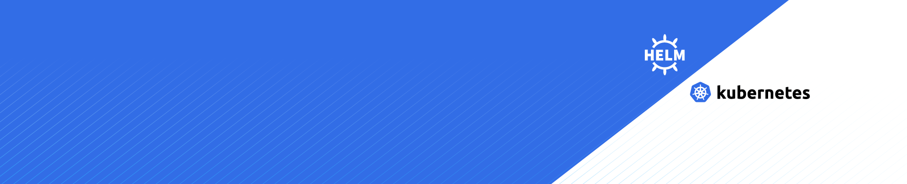

# k8s-helm-client

A Helm chart to deploy a client (frontend) application on Kubernetes.

## Features
- **Environment-Specific**: Easily switch between `dev`, `staging`, and `prod` using `values.yaml`.
- **Ingress Configuration**: Out-of-the-box TLS support (via cert-manager annotations) and custom hostnames.
- **Autoscaling**: Optional Horizontal Pod Autoscaler (HPA) for scaling based on CPU usage.
- **ConfigMaps & Secrets**: Inject environment-specific variables and secure credentials with minimal effort.
- **Easy Overrides**: Override chart values via command-line or custom YAML files.

## Prerequisites
- A running [Kubernetes](https://kubernetes.io/) cluster
- [Helm 3.x](https://helm.sh/docs/intro/install/)
- (Optional) [cert-manager](https://cert-manager.io/docs/) if you want automatic TLS certificates

## Quick Start 🚀

1. **Clone the Repo**

    ```bash
    git clone https://github.com/mohamed-ben-khemis/k8s-helm-client.git
    cd k8s-helm-client
    ```

2. **Install the Chart**

    ```bash
    # Example deployment to dev environment
    helm install my-frontend . \
      --set env=dev \
      --set clientApp.image.repository.dev="your-image" \
      --set clientApp.image.tag="your-tag" \
    ```


      If you want to try it fast, use the following command:
      
      ```bash
        helm install my-frontend . \
        --set env=dev \
        --set clientApp.image.repository.dev="nginxdemos/hello" \
        --set clientApp.image.tag="latest" \
        --set service.port=80 \
        --set service.targetPort=80
      ```
      Forward Your Client App Service
      To forward the client app service to your local machine, use:
      ```bash
      kubectl port-forward svc/client-app-service 3000:80
      ```
      The application will then be accessible at http://localhost:3000.

3. **Verify the Deployment**

    ```bash
    kubectl get pods
    kubectl get svc
    kubectl get ingress
    ```

    - **Pods**: Check that the client application containers are running.
    - **Service**: By default, it’s a ClusterIP service on port 3000(target port 80).
    - **Ingress**: If enabled, ensure your hostnames and TLS certificates (if using cert-manager) are correctly configured.

## Configuration

You can configure the chart using `values.yaml` or by passing `--set` parameters when running `helm install/upgrade`.

Below are some of the key fields:

| Parameter                                         | Description                                                           | Default                                  |
|---------------------------------------------------|-----------------------------------------------------------------------|------------------------------------------|
| `env`                                             | Target environment (e.g., `dev`, `staging`, `prod`)                  | `dev`                                    |
| `clientApp.image.repository.dev`                  | Docker image used in `dev`                                           | `image:${VERSION}`                       |
| `clientApp.image.repository.staging`              | Docker image used in `staging`                                       | `image:${VERSION}`                       |
| `clientApp.image.repository.prod`                 | Docker image used in `prod`                                          | `image:${VERSION}`                       |
| `clientApp.image.tag`                             | Docker image tag (applies to all environments unless overridden)      | `your-tag`                               |
| `clientApp.replicas.dev`                          | Number of replicas in `dev`                                          | `1`                                      |
| `clientApp.replicas.staging`                      | Number of replicas in `staging`                                      | `1`                                      |
| `clientApp.replicas.prod`                         | Number of replicas in `prod`                                         | `2`                                      |
| `configMap.enabled`                               | Toggle creation of a ConfigMap                                       | `true`                                   |
| `configMap.data.dev`                              | Env variables for `dev` environment                                  | *Empty by default*                       |
| `configMap.data.staging`                          | Env variables for `staging` environment                              | *Empty by default*                       |
| `configMap.data.prod`                             | Env variables for `prod` environment                                 | *Empty by default*                       |
| `secret.enabled`                                  | Toggle creation of a Secret                                          | `false`                                  |
| `service.type`                                    | Kubernetes Service type                                              | `ClusterIP`                              |
| `service.port`                                    | Service port                                                         | `3000`                                   |
| `autoscaling.enabled`                             | Enable Horizontal Pod Autoscaler                                     | `false`                                  |
| `autoscaling.minReplicas`                         | Minimum number of replicas                                           | `1`                                      |
| `autoscaling.maxReplicas`                         | Maximum number of replicas                                           | `10`                                     |
| `autoscaling.targetCPUUtilizationPercentage`      | CPU utilization target for scaling                                   | `80`                                     |
| `podDisruptionBudget.enabled`                     | Enable Pod Disruption Budget                                         | `false`                                  |
| `podDisruptionBudget.maxUnavailable`              | Max unavailable pods during disruptions                              | `1`                                      |
| `ingress.enabled.dev`                             | Enable Ingress for dev                                               | `true`                                   |
| `ingress.enabled.staging`                         | Enable Ingress for staging                                           | `true`                                   |
| `ingress.enabled.prod`                            | Enable Ingress for prod                                              | `true`                                   |
| `ingress.hostname.dev`                            | Hostname for dev                                                     | `dev.domain.com`                         |
| `ingress.hostname.staging`                        | Hostname for staging                                                 | `staging.domain.com`                     |
| `ingress.hostname.prod`                           | Hostname for prod                                                    | `domain.com`                             |
| `ingress.tls`                                     | Toggle TLS setup                                                     | `true`                                   |
| `ingress.annotations`                             | Custom annotations for Ingress                                       | `{ cert-manager.io/cluster-issuer: ... }` |
| `resources.requests.cpu`                          | CPU requests for the container                                       | `100m`                                   |
| `resources.requests.memory`                       | Memory requests for the container                                    | `250Mi`                                  |
| `resources.limits.cpu`                            | CPU limit for the container                                          | `200m`                                   |
| `resources.limits.memory`                         | Memory limit for the container                                       | `500Mi`                                  |

For more details, check the [values.yaml](./values.yaml) file in this repository.

## Development

- Feel free to open issues or pull requests if you encounter bugs or have feature requests.
- If you’re adding or updating templates, please test them with `helm template` or in a local Kubernetes cluster.

## Contributing

1. Fork the repository and create a new branch.  
2. Make your changes with clear commit messages.  
3. Submit a pull request explaining your changes.  

All contributions are welcome and appreciated!
---

## ❤️ Support

If you've found this project useful and would like to support its ongoing development, you can donate via [Buy Me a Coffee](https://buymeacoffee.com/mohamed.ben.khemis):

[](https://buymeacoffee.com/mohamed.ben.khemis)

Your support is greatly appreciated! ☕️❤️

## License

This project is licensed under the [MIT License](./LICENSE). See the LICENSE file for details.
